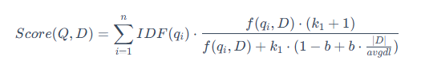

RAG 的基础是 embedding 嵌入，这项技术是将文本转换为向量表示，然后通过计算向量之间的相似度来找到最相关的文档。向量数据库是 RAG 的核心组件，它存储了所有文档的向量表示，以及这些向量之间的相似度。核心查询方式是**相似性搜索**

RAG 指在不改变大模型本身的基础上，通过外挂知识库等方式，为模型提供特定领域的数据信息输入。他是一种**结合信息检索（Retrieval） 和文本生成（Generation） 的技术**，旨在让大语言模型（LLM）生成更准确、实时的回答。这里的具体应用是当用户提出一个问题时，程序会去向量库中首先检索相关数据，找到与问题相关的信息，然后将检索出来的内容作为上下文一起传给大模型，让大模型了解相关知识以了解更加精准的内容。这么说可能有些抽象，举个实际一点的例子吧：

比如用户发问：我想了解一下 mybatis-plus 的使用。但是这个时候假如模型没有 mybatis-plus 相关训练数据，他不知道 mp 相关知识，因此根本没有办法返回用户正确信息，如果使用微调的方式处理这个问题，我们可能需要两三天，还需要大量数据，更重要的问题是，这么做很烧钱

此时我们先将用户的问题去向量库（比如 es）中搜索这个问题，假设向量库提前存好了全量的 mp 信息，向量库提取了关键字 mp，并且返回了全套的 mp 使用文档。我们在把这个文档当作 system 设置去访问大模型，这个时候大模型就知道要给用户返回什么了

上面图中的 RAG 模块所使用到的技术，其实都不是 LLM 专属的，是向量库中所使用到的技术。embedding 是文本向量化技术

## 基础概念

当评估一个分类模型（尤其是二分类模型）的好坏时，经常能看见几个核心指标：精确率、召回率、F1值

精确率是决策正确的比例。在模型所有预测为是的案例中，有多少是真正的是？主要关注模型预测为是时的可信度，高精确率表示模型把握很大才做出阳性预测，最大限度地减少了误报。eg：垃圾邮件过滤器，高精确率表示正常邮件被判断为垃圾邮件的概率很低（此场景下我们关注的是垃圾邮件被正确识别）

召回率关注模型找出所有目标的能力。高召回率表示是模型在尽可能找出所有正例，最大限度地减少漏报

eg：疾病筛查。高召回率表示找出几乎所有患者（高 TP，即使着会导致许多健康人需要二次检查，即高 FP）

我们需要关注精确率与召回率的权衡，精确率和召回率在大多数情况下是互相矛盾的。提高判断标准以提升精确率（减少 FP），通常会导致召回率下降（增加 FN）

反之放宽标准以提升召回率（减少 FN），通常会导致精确率下降（增加 FP）。模型优化常常是在寻找两者之间的一个可接受的平衡点。F1 值指的就是衡量综合平衡能力。F1值 = 2*（精确率 * 召回率）/（精确率+召回率）

在对 rag 做任何改动之后，一定要 ab 来评估召回率和精准度

## Chunk 文本分块
目前业内做 RAG 的通用方式是，将要保存的文档切分成多个小知识片段，这些小知识片段都包含了一问一答，来实现知识库的。这么做可以通过将文档分解成更小的单元，可以更精确地匹配用户的查询，减少无关信息的干扰，从而提高检索的准确性和效率。同时当需要更新或修正某部分信息时，只需修改相应的片段，而不需要重新处理整个文档，这使得知识库的维护变得更加灵活和高效。而存入大文档，就没有这些优点了

为什么将文档分解成更小的单元就可以更精确地匹配用户的查询呢？大多数嵌入模型都基于 Transformer 编码器，最后存放在向量库中的是输入文档所生成的高维向量，在这个压缩过程中，信息损失是不可避免的。一个768维的向量需要概括整个文本块的所有信息，当输入文本非常长时每个 token 的贡献被摊薄，导致局部关键信息难以在最终向量中产生显著影响。文本块越长，包含的语义点越多，这个单一向量所承载的信息就越稀释

那在工程上如何去处理这个问题呢，一般来说有以下几种解法：
### 分块策略
- 固定大小分块（如 256/512 tokens，有重叠）：将长文档切成多个短块，每个块独立向量化。查询时检索最相关的块，再返回所属文档。比如按段落分割、按分隔符分割，适用于通用 RAG、文档问答。
- 语义分块（基于句子边界或主题分割）：用模型或人工识别段落边界或主题转折点，切出语义完整的片段。适用于对连贯性要求高的文档（如论文、法律条文）。
- 摘要/索引/先传入问答：先对长文档生成摘要（或提取关键句），对摘要进行向量化，查询时检索最相关的摘要，再根据摘要返回所属文档。还有一种更狠的处理方案，因为 RAG 都是用来检索的，我们可以直接在 RAG 中存放用户要问的问题，然后根据问题返回对应的文档。
- 使用长上下文模型 + 特殊池化：某些模型（如 E5-mistral-7b）支持 32k token，并采用“last token pooling”而非平均池化，可更好保留尾部信息。	必须处理完整长文档但预算充足的场景。

## 向量数据库
### 向量数据库选型

我们可以选择一些托管服务。这类适合那些不希望花精力在运维上，追求快速上线的团队。

- Zilliz Cloud：它基于全球热门的开源数据库 Milvus 打造，自带高性能和数十亿向量处理能力，并通过公有云提供服务。非常适合那些希望拥有 Milvus 强大性能，但不想自己搭建和运维复杂集群的团队。
- 腾讯云 VectorDB：这款云原生数据库集成了 AI 套件，支持像 Markdown、PDF 等文档的自动解析、向量化和检索，大大降低了入门门槛。在 VectorDBBench 性能榜单上表现亮眼，成本据称仅为同类产品的1/3。非常适合初创团队和需要快速构建知识库的中小企业。
- MongoDB Atlas Vector Search：在开发者调查中，它的净推荐值（NPS）是最高的，非常受欢迎。优势在于能将文档数据库和向量搜索无缝结合，非常适合那些已经深度使用 MongoDB 的团队，可以复用现有生态。

同时还可以选择一些开源数据库，这类适合有一定运维能力，希望深度掌控技术栈的团队。

- Milvus（Zilliz）：全球最流行的开源向量数据库，在 GitHub 上有超过35,000颗星。它核心优势在于分布式架构并且生态完整，提供 Python/Java/Go 等多种语言的 SDK，能与 Spark、Flink 等大数据生态深度集成，也支持 LangChain 等 AI 框架。
- Qdrant：一个用高性能语言 Rust 写成的数据库，性能很突出。它的优势在于高性能并且功能丰富

当然下面这些优秀的工程也可以解决我们的问题：

- PgVector：对于已经在使用 PostgreSQL 的团队来说，这是个很“顺手”的选择。它是一个扩展插件，让你能在熟悉的 PostgreSQL 环境中同时处理关系数据和向量数据，用 SQL 进行混合查询。优势是复用现有数据库，无需引入新组件，但缺点也很明显：在向量搜索性能上不如专用的数据库，索引构建也较慢。同样适合百万级以下规模
- Elasticsearch：在原有的全文搜索强项基础上增加了向量搜索功能，统一了全文检索和向量检索。适合已经深度使用 ES，希望升级到“语义+关键词”混合搜索的场景
- FAISS：严格意义上说，它是一个高效的相似性搜索库而非完整的数据库，由 Facebook 开源。它提供了多种先进的索引算法，性能卓越，适合个人本地项目练手

### 向量搜索算法
#### 余弦相似度
余弦相似度是一种常用的向量相似度计算方法，它将向量表示为单位向量，然后计算它们之间的夹角余弦值。余弦相似度的取值范围是 -1 到 1，1 表示两个向量完全相同，-1 表示完全相反。两个向量 a 和 b 的余弦相似度定义为：


就是初中学的 cosine 相似度，||a|| 表示向量 a 的模长（就是 a 的直线长度），a * b 表示向量 a 和 b 的内积（内积的算法是 a 的第一个元素乘以 b 的第一个元素，第二个元素乘以 b 的第二个元素，...，最后全部加起来）

下面是一段 FAISS 中索引嵌入的代码：
```py
quantizer = faiss.IndexFlatIP(dim)
index = faiss.IndexIDMap(quantizer)
print(f"  索引类型: IndexIDMap(IndexFlatIP), 维度={index.d}")

# L2 归一化后，两个向量的内积 = 余弦相似度（值域 [-1, 1]），这样就方便搜索了
all_vecs = np.array(vectors, dtype=np.float32)
faiss.normalize_L2(all_vecs) 这啥意思
```
IndexFlatIP 是 FAISS 中最基础的索引类型之一，它使用暴力搜索（精确计算所有向量与查询向量的内积）来检索数据。IP 表示 Inner Product（内积），即直接计算两个向量的点积。dim 是向量的维度（比如 768、1024 等）。

为啥做向量检索之前要做归一化处理？其实向量的模长也具有一定的信息，归一化与否，取决于你想要的相似度到底指什么——是方向相似还是整体相近。

- 如果你关心的是向量的方向（例如文本语义、用户兴趣偏好），那么模长往往是噪音，归一化能让你专注于方向比较。
- 如果你关心的是向量的模长（例如图片亮度、词频计数、向量嵌入的置信度），那么归一化会丢失信息，此时不应归一化。

所以在做语义检索时，归一化是为了消除模长干扰，让检索结果反映真正的语义相似性

### 向量数据库索引
索引是向量数据库的核心，它负责快速检索向量。不同的索引算法有不同的优势和适用场景，选择合适的索引算法是向量数据库性能的关键

| 索引类型 | 核心思想 | 主要优点 | 主要缺点 / 注意事项 | 最佳实践场景 |
| :--- | :--- | :--- | :--- | :--- |
| **暴力检索 (IndexFlatL2/IP)** | 精确计算查询向量与所有向量的距离。 | 精度 100%，实现简单，无需训练。 | 大数据量下速度慢，内存占用高。 | 数据量小（万级以下）的基线测试。 |
| **IVF 倒排索引** | 先通过聚类将数据分组，查询时只在最近的几个组内搜索。 | 大幅提升搜索速度，是精确索引到近似索引的第一步。 | 仍然需要对分组内的向量进行距离计算，速度有提升但非极致。 | 百万级别的向量库，是迈向工业级应用的第一步。 |
| **PQ 乘积量化** | 将向量分段，对每一段进行压缩编码，极致压缩内存。 | 内存占用极小，搜索速度快。 | 召回率下降较明显。 | 内存资源极度稀缺，且可以接受一定精度损失的场景。 |
| **IVF+PQ 混合索引** | 工业界主流方案，先用IVF分组，再用PQ压缩组内向量。 | 在速度、内存、精度上取得较好的平衡。 | 实现和调参相对复杂。 | 对各项指标均有要求，没有极端偏好的通用首选。 |
| **HNSW 分层图** | 构建多层导航图进行搜索，是目前最快的算法之一。 | 查询速度极快，召回率极高（约97%）。 | 内存占用极大（比原始数据还大），构建索引慢。 | 极速查询是核心要求，且内存资源充足。 |
| **LSH 局部敏感哈希** | 通过哈希函数将相似向量映射到同一个桶中。 | 内存占用小，训练快。 | 召回率较低。 | 内存资源稀缺，且允许较低召回率的离线检索场景。 |

## 搜索优化
当然 RAG 在实际应用中常常面临挑战，例如检索结果不精确、上下文信息有噪声、生成答案偏离主题等。为了克服基础 RAG 的局限性，研究和实践领域发展出了高级 RAG（Advanced RAG）的概念，会使用下面方法增加 rag 的召回率

### 查询预处理
用户的原始问题往往不是最优的检索输入。它可能过于复杂、包含歧义，或者与文档的实际措辞存在偏差。为了解决这些问题，我们需要在检索之前对用户的查询进行预处理
#### 查询扩展
查询扩展是指生成原始查询的多个变体或补充相关术语。比如多查询生成，可以提示 LLM：“为以下用户问题生成3个不同的版本，以便更好地从向量数据库中检索信息：[用户原始问题]”。系统随后并行执行这些查询，并将所有检索结果合并，以供后续的重排序和生成阶段使用，比如：

- 原始问题：“在《流浪地球》中，刘慈欣对人工智能和未来社会结构有何看法？”
- 分解后的子问题：
-- “《流浪地球》中描述的人工智能技术有哪些？”
-- “《流浪地球》中描绘的未来社会是怎样的？”
-- “刘慈欣关于人工智能的观点是什么？”

#### 结构化索引 + 自查询
随着知识库的规模不断扩大（例如，包含数百个 PDF 文件），传统的 RAG 方法（即对所有文本块进行 top-k 相似度搜索）会遇到瓶颈。当一个查询可能只与其中一两个文档相关时，在整个文档库中进行无差别的向量搜索，不仅效率低下，还容易被不相关的文本块干扰，导致检索结果不精确

为了解决这个问题，一个有效的方法是利用结构化索引。其原理是在索引文本块的同时，为其附加结构化的元数据（Metadata）。这些元数据可以是任何有助于筛选和定位信息的标签，例如：

- 文件名
- 文档创建日期
- 章节标题
- 作者
- 任何自定义的分类标签

通过这种方式，可以在检索时实现元数据过滤和向量搜索的结合。例如，当用户查询“请总结一下2023年第二季度财报中关于 AI 的论述”时，系统可以先做元数据预过滤，只在 document_type == '财报'、year == 2023 且 quarter == 'Q2' 的文档子集中进行搜索。然后做向量搜索，在经过滤的、范围更小的文本块集合中，执行针对查询“关于 AI 的论述”的向量相似度搜索

这种先过滤，再搜索的策略，能够极大地缩小检索范围，显著提升大规模知识库场景下 RAG 应用的检索效率和准确性。LlamaIndex 提供了包括自动检索（Auto-Retrieval）在内的多种工具来支持这种结构化的检索范式

结构化索引的元数据通常与向量数据共同存储在向量数据库内部（以标量字段/元数据字段的形式），但具体位置取决于所选的存储方案——专用向量库、传统数据库+向量扩展、还是向量库+关系库的混合架构，处理方式各不相同，这些选型都是可以的，Milvus 就使用标量字段存放，而 PostgreSQL + pgvector	则是使用普通表列（独立列）或 JSONB 列存放，大公司的 RAG 系统可能会使用向量库存向量，MySQL/PostgreSQL 存结构化元数据，通过 doc_id 关联

值得一提的是，自查询和结构化索引不是同一个概念，它们分属 RAG 流程的不同环节——结构化索引属于索引构建阶段的基础设施，自查询属于检索阶段的查询构造技术，前者是后者的前提，但两者并不等价

### 多路召回

多路召回是推荐系统、信息检索等领域中的一种常用技术策略，也是工业级标配，核心思想是通过**多个不同的召回路径**从海量数据中快速筛选出和搜索目标可能相关的候选集，为后续的排序、精排等环节提供基础

比如说，我们需要搜和用户兴趣相关的数据，用户兴趣可能体现在多个方面，单一召回路径难以全面捕捉。比如用户要买东西，我们可能通过用户浏览记录、搜索记录、相似产品等多个维度推荐用户物品。其核心在于用多样性对抗不确定性

下面说的 BM25 + 向量检索 + RRF 融合是大多数系统使用的多路召回策略，但是多路召回除了稀疏 + 密集两路，还可以纳入知识图谱检索、SQL 精确查询、元数据过滤、多模态检索等更多召回源

#### 稀疏向量和密集向量
混合检索（Hybrid Search）是一种结合了稀疏向量（Sparse Vectors） 和密集向量（Dense Vectors） 优势的先进搜索技术。旨在同时利用稀疏向量的关键词精确匹配能力和密集向量的语义理解能力，以克服单一向量检索的局限性，从而在各种搜索场景下提供更准确的检索结果

1，稀疏向量，也常被称为词法向量，是基于词频统计的传统信息检索方法的数学表示。它通常是一个维度极高（与词汇表大小相当）但绝大多数元素为零的向量。它采用精准的词袋匹配模型，将文档视为一堆词的集合，不考虑其顺序和语法，其中向量的每一个维度都直接对应一个具体的词，非零值则代表该词在文档中的重要性（权重）。这类向量的经典权重计算方法是 TF-IDF。在信息检索领域，BM25 则是基于这种稀疏表示的成功且应用广泛的排序算法之一，其核心公式如下：

这种方法的优点是可解释性极强（每个维度都代表一个确切的词），无需训练，能够实现关键词的精确匹配，对于专业术语和特定名词的检索效果好。主要缺点是无法理解语义，例如它无法识别“汽车”和“轿车”是同义词，存在“词汇鸿沟”

2，密集向量，也常被称为语义向量，是通过深度学习模型学习到的数据（如文本、图像）的低维、稠密的浮点数表示。这些向量旨在将原始数据映射到一个连续的、充满意义的语义空间中来捕捉语义或概念。在理想的语义空间中，向量之间的距离和方向代表了它们所表示概念之间的关系。一个经典的例子是 vector('国王') - vector('男人') + vector('女人') 的计算结果在向量空间中非常接近 vector('女王')，这表明模型学会了“性别”和“皇室”这两个维度的抽象概念。它的代表包括 Word2Vec、GloVe、以及所有基于 Transformer 的模型（如 BERT、GPT）生成的嵌入（Embeddings）

其主要优点是能够理解同义词、近义词和上下文关系，泛化能力强，在语义搜索任务中表现卓越。但缺点也同样明显：可解释性差（向量中的每个维度通常没有具体的物理意义），需要大量数据和算力进行模型训练，且对于未登录词（OOV）1的处理相对困难

OOV（Out-of-Vocabulary）未登录词：指在模型训练时没有出现在词汇表中，但在实际使用时遇到的新词汇。例如，如果模型训练时词汇表中没有 ChatGPT 这个词，那么在实际应用中遇到它时就是 OOV。传统的稀疏向量方法（如 BM25）对 OOV 词汇会完全忽略，而现代的密集向量方法通过子词分割（如 BPE、WordPiece）可以更好地处理 OOV 问题

RRF 处于召回（Retrieval）和精排（Rerank）之间的融合层，它的工作是把多路召回各自产出的排序列表拼成一个统一的候选集。一般来说，它只能判断这个文档在多路里是不是都排得靠前，无法判断这个文档到底跟 query 相关不相关，因此我们还需要一次精排

### 查询后处理
查询后处理的最出名的步骤是重排序（Rerank）机制

#### 重排序 Rerank
重排序是在检索增强生成模型中一个关键的后续处理步骤，用于优化从文档库中检索到的相关段落或文档的顺序。在 RAG 模型中，通常先使用一个检索器从大量文档中找出与查询最相关的内容，然后这些内容传递给生成模型来进行排序。因为最初的检索结果可能并不完美，重排序步骤使用一个计算量更大但更精确的模型，对初步检索出的前 K 个结果进行重新打分和排序，在进一步提升检索质量，确保最相关的信息位于首位

重排序通常涉及以下步骤，比如用户需要搜索一个有关 ssm 的知识：

1，初步检索：使用快速检索算法（如 BM25）找到与查询相关的初始候选集合
2，深度学习模型评分：将初步检索结果中的每个文档或段落以及原始查询输入到深度学习模型（如 BERT 或其他 Transformer 模型）中，该模型会为每个文档分配一个相关性得分
3，排序：根据深度学习模型给出的得分，重新排列初步检索结果的顺序，确保得分最高的文档排在前面

关于深度学习模型评分和排序，我们有很多方案，最简单的一种是直接用大型语言模型本身来进行重排，只需要一个提示词即可

当然过程中更加优秀的方案是使用交叉编码器，这就引入了一些新知识点：

rag 中嵌入和模型嵌入没啥区别，而当前主流的嵌入模型通常是基于 BERT 的变体，关于模型的选型上，一般采用**双塔模型**：Query 和 Document 各自用一个编码器单独处理，最后用向量相似度（如余弦、内积）来评估它们的相关性

这两个塔参数可以共享，也可以不共享，编码器（将文本嵌入）一般是 BERT、MiniLM、E5、BGE 等。这种模型非常适合 rag，可以预先编码文档向量，Query 来时只需要做一次检索，适合大规模检索（粗排），但是无法捕捉 Query 和文档之间的精细交互

**交叉编码器**（Cross-Encoder）非常适合精排，交叉编码器是 Rerank 阶段常用模型结构，核心是 Query 和 Document 拼接在一起，通过 Transformer 层 token 级别全交叉注意力处理。每个词之间都可以感知彼此的存在，无论它是 Query 词还是 Doc 词。精度最高，因为 Query 和 Doc 的所有 token 之间都能互动，可学习精细的匹配特征（如实体、数字、语法），非常慢，不能预编码，每一对 Query + Doc 都要重新跑一遍模型，不适合大规模检索，只适合精排（Rerank）

因此目前工程上推荐的流程是双塔粗排后让交叉精排，上述说的模型评分技术特指交叉编码器

#### 上下文扩展/父子块映射
在 RAG 系统中，常常面临一个权衡问题：使用小块文本进行检索可以获得更高的精确度，但小块文本缺乏足够的上下文，可能导致大语言模型（LLM）无法生成高质量的答案；而使用大块文本虽然上下文丰富，却容易引入噪音，降低检索的相关性

为了解决这一矛盾，LlamaIndex 提出了一种实用的索引策略——句子窗口检索。该技术巧妙地结合了两种方法的优点：它在检索时聚焦于高度精确的单个句子，在送入 LLM 生成答案前，又智能地将上下文扩展回一个更宽的窗口，从而同时保证检索的准确性和生成的质量

句子窗口检索的思想可以概括为：为检索精确性而索引小块，为上下文丰富性而检索大块，其工作流程如下：

1，索引阶段：在构建索引时，文档被分割成单个句子。每个句子都作为一个独立的节点存入向量数据库。同时，每个句子节点都会在元数据（metadata）中存储其上下文窗口，即该句子原文中的前 N 个和后 N 个句子。这个窗口内的文本不会被索引，仅仅是作为元数据存储

2，检索阶段：当用户发起查询时，系统会在所有单一句子节点上执行相似度搜索。因为句子是表达完整语义的最小单位，所以这种方式可以非常精确地定位到与用户问题最相关的核心信息

3，后处理阶段：在检索到最相关的句子节点后，系统会使用一个名为 MetadataReplacementPostProcessor 的后处理模块。该模块会读取到检索到的句子节点的元数据，并用元数据中存储的完整上下文窗口来替换节点中原来的单一句子内容

4，生成阶段：最后，这些被替换了内容的、包含丰富上下文的节点被传递给 LLM，用于生成最终的答案

其思想可以应用到更广维度的事情上，比如说元数据不一定是上下文窗口，而是其他附带信息——模型判断的和该句话有关的任何信息。比如说：

- 我需要查询一个人，我们可以在元数据上插入这个人的兴趣、性别、工作等等
- 父子块映射也算是上下文扩展维度之一，用小块做精准召回、父块补上下文，兼顾检索精度与上下文完整性
- 入库前用 LLM 对每段提取关键词或生成摘要，作为额外索引路提升短 query 召回

#### 上下文压缩
与上下文扩展相对的是上下文压缩

随着检索到的上下文信息越来越丰富，一个常见的问题是，拼接后的增强提示可能会变得非常长，甚至超出 LLM 的上下文窗口限制。此外，输入的内容还可能包含大量无关的噪音文本。提示压缩技术应运而生，其目标是在不显著损害（甚至有时能提升）生成质量的前提下，减少输入到 LLM 的上下文 Token 数量。方案有以下两种：

- 内容提取：从文档中只抽出与查询相关的句子或段落
- 文档过滤：完全丢弃那些虽然被初步召回，但经过更精细判断后认为不相关的整个文档

## RAG 系统评估

我们一般使用 RAG 评估三元组来评估一个 RAG 系统的好坏，包含以下三个维度：

（1）上下文相关性 (Context Relevance)

- 评估目标： 检索器（Retriever）的性能。
- 核心问题： 检索到的上下文内容，是否与用户的查询（Query）高度相关
- 重要性： 检索是 RAG 应用在响应用户查询时的第一步。如果检索回来的上下文充满了噪声或无关信息，那么无论后续的生成模型多么强大，都没法做出正确答案

（2）可信度 (Groundedness)

- 评估目标： 生成器的可靠性。
- 核心问题： 生成的答案是否完全基于所提供的上下文信息
- 重要性： 这个维度主要在于量化 LLM 的幻觉程度。一个高忠实度的回答意味着模型严格遵守了上下文，没有捏造或歪曲事实。如果忠实度得分低，说明 LLM 在回答时自由发挥过度，引入了外部知识或不实信息。

（3）答案相关性 (Answer Relevance)

- 评估目标： 系统的端到端（End-to-End）表现。
- 核心问题： 最终生成的答案是否直接、完整且有效地回答了用户的原始问题
- 重要性： 这是用户最直观的感受。一个答案可能完全基于上下文（高忠实度），但如果它答非所问，或者只回答了问题的一部分，那么这个答案的相关性就很低。例如，当用户问“法国在哪里，首都是哪里？”，如果答案只是“法国在西欧”，那么虽然忠实度高，但答案相关性很低。

第一个是搜索时问题，后两个是生成时问题，三个维度可以分两个模块来进行测试

### 检索评估
检索评估聚焦于 RAG 三元组中的上下文相关性 (Context Relevance)，本质上是一次白盒测试。此阶段的评估需要一个标注数据集，其中包含一系列查询以及每个查询对应的真实相关文档

这项评估借鉴了信息检索领域的多个经典指标：

上下文精确率 (Context Precision): 衡量检索结果的准确性。计算在检索到的前 k 个文档中相关文档所占的比例，其中 k 是一个预设的数字，代表评估的范围。高精确率意味着检索结果的噪声较少

上下文召回率 (Context Recall): 衡量检索结果的完整性。计算在检索到的前 k 个文档中，找到的相关文档占所有真实相关文档总数的比例。高召回率意味着系统能够成功找回大部分关键信息

F1 分数 (F1-Score): F1 分数是精确率和召回率的调和平均数，它同时兼顾了这两个指标，在它们之间寻求平衡。当精确率和召回率都高时，F1 分数也高

一般来说，使用一套在业务中总结出的比较有代表性的测评集，为测评集人工输入高 F1 的答案，然后使用 RAG 系统测试这套测评集，是评估搜索的最佳实践，这样做出的 RAG 系统最符合业务需求。关于测试，是利用一个高性能、中立的 llm 作为评估者，对上述维度进行深度的语义理解和打分

### 生成评估
响应评估覆盖了 RAG 三元组中的忠实度和答案相关性。此环节通常采用端到端的评估范式，因为它直接衡量用户感知的最终输出质量。无论采用何种评估方法，都主要围绕以下两个核心维度展开

（1）可信度：衡量生成的答案在多大程度上可以由给定的上下文所证实。一个完全忠实的答案，其所有内容都必须能在上下文中找到依据，以此避免模型产生幻觉

（2）答案相关性：衡量生成的答案与用户原始查询的对齐程度。一个高相关性的答案必须是直接的、切题的，并且不包含与问题无关的冗余信息


## 实战问题
上述的索引优化和检索优化已经可以解决大部分 RAG 相关的问题了，接下来我们看几个实战案例
### 用户输入的字有错别字时如何提升搜索准确度

错别字会改变向量的数值分布，导致**语义漂移**，使得原本相似的向量在空间中距离变远。在工业级应用中，单纯依赖索引类型（如 IVF+PQ 或 HNSW）无法解决错别字问题，因为它们是精确匹配或近似数值匹配的逻辑。要提升准确度，需要从输入清洗和检索策略两个层面入手

1，查询端预处理，在向量化之前，先对用户输入进行模糊匹配和矫正

- 拼音/字形纠错：利用混淆词典（如 登陆 -> 登录，pyhton -> python）。对于中文，可结合拼音相似度（如 zhi 和 zi）和五笔/笔画编码进行修正

- 基于上下文的预训练纠错模型：使用专门的错别字纠正模型（如基于 BERT 微调的纠错模型），在输入检索系统前，先将明显错误替换为概率最高的正确词汇

2，数据增强训练：在构建向量库的模型训练阶段，加入对抗性样本。即在训练语料中，随机将20%~30%的文本中的字替换为形近字（如 己、已、巳）或音近字，让模型学习到这些字符虽不同，但语义相近的嵌入空间

3，多路召回，不依赖单一向量。针对同一份文档，存储两种向量：

语义向量由完整句子生成，而字符向量由拼音序列或笔画序列生成，错字通常拼音/笔画接近。当用户输入错别字时，拼音/笔画向量的相似度不受影响，可以互补召回