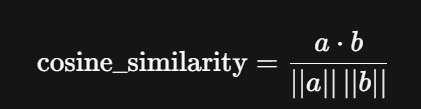

RAG 的基础是 embedding 嵌入，这项技术是将文本转换为向量表示，然后通过计算向量之间的相似度来找到最相关的文档。

向量数据库是 RAG 的核心组件，它存储了所有文档的向量表示，以及这些向量之间的相似度。

## 向量数据库选型

### 第一类：拿来即用的托管服务
这类适合那些不希望花精力在运维上，追求快速上线的团队。

Zilliz Cloud：它基于全球热门的开源数据库 Milvus 打造，自带高性能和数十亿向量处理能力，并通过公有云提供服务。非常适合那些希望拥有 Milvus 强大性能，但不想自己搭建和运维复杂集群的团队。

腾讯云 VectorDB：这款云原生数据库集成了AI套件，支持像Markdown、PDF等文档的自动解析、向量化和检索，大大降低了入门门槛。在VectorDBBench性能榜单上表现亮眼，成本据称仅为同类产品的1/3。非常适合初创团队和需要快速构建知识库的中小企业。

MongoDB Atlas Vector Search：在开发者调查中，它的净推荐值（NPS）是最高的，非常受欢迎。优势在于能将文档数据库和向量搜索无缝结合，非常适合那些已经深度使用 MongoDB 的团队，可以复用现有生态。

### 第二类：开源数据库
这类适合有一定运维能力，希望深度掌控技术栈的团队。

Milvus（Zilliz）：全球最流行的开源向量数据库，在 GitHub 上有超过35,000颗星。它核心优势在于分布式架构并且生态完整，提供 Python/Java/Go 等多种语言的 SDK，能与 Spark、Flink 等大数据生态深度集成，也支持 LangChain 等 AI 框架。

Qdrant：一个用高性能语言Rust写成的数据库，性能很突出。它的优势在于高性能并且功能丰富

### 第三类：轻量嵌入的创新之选
这类适合追求极简开发、本地运行或在特定场景下有创新需求的情况。

Chroma：它被誉为"开发者的第一选择"，以极简的 Python 体验闻名。直接通过 pip install chromadb 即可安装运行，因此与 LangChain 等 AI 框架的集成也做得非常好。非常适合开发和测试环境、POC 验证，以及不超过10万份文档的小规模内部工具。需要注意的是，它在处理百万级以上的大规模数据时性能会明显下降。

PgVector：对于已经在使用 PostgreSQL 的团队来说，这是个很“顺手”的选择。它是一个扩展插件，让你能在熟悉的 PostgreSQL 环境中同时处理关系数据和向量数据，用 SQL 进行混合查询。优势是复用现有数据库，无需引入新组件，但缺点也很明显：在向量搜索性能上不如专用的数据库，索引构建也较慢。同样适合百万级以下规模。

Elasticsearch：在原有的全文搜索强项基础上增加了向量搜索功能，统一了全文检索和向量检索。适合已经深度使用 ES，希望升级到“语义+关键词”混合搜索的场景。

FAISS：严格意义上说，它是一个高效的相似性搜索库而非完整的数据库，由 Facebook 开源。它提供了多种先进的索引算法，性能卓越，适合那些需要深度定制检索算法、并有较强工程能力的团队。

## 向量搜索算法
### 余弦相似度
余弦相似度是一种常用的向量相似度计算方法，它将向量表示为单位向量，然后计算它们之间的夹角余弦值。余弦相似度的取值范围是 -1 到 1，1 表示两个向量完全相同，-1 表示完全相反。两个向量 a 和 b 的余弦相似度定义为：



就是初中学的 cosine 相似度，||a|| 表示向量 a 的模长（就是 a 的直线长度），a * b 表示向量 a 和 b 的内积（内积的算法是 a 的第一个元素乘以 b 的第一个元素，第二个元素乘以 b 的第二个元素，...，最后全部加起来）

下面是一段 FAISS 中索引嵌入的代码：
```py
quantizer = faiss.IndexFlatIP(dim)
index = faiss.IndexIDMap(quantizer)
print(f"  索引类型: IndexIDMap(IndexFlatIP), 维度={index.d}")

# L2 归一化后，两个向量的内积 = 余弦相似度（值域 [-1, 1]），这样就方便搜索了
all_vecs = np.array(vectors, dtype=np.float32)
faiss.normalize_L2(all_vecs) 这啥意思
```
IndexFlatIP 是 FAISS 中最基础的索引类型之一，它使用暴力搜索（精确计算所有向量与查询向量的内积）来检索数据。IP 表示 Inner Product（内积），即直接计算两个向量的点积。dim 是向量的维度（比如 768、1024 等）。

为啥做向量检索之前要做归一化处理？其实向量的模长也具有一定的信息，归一化与否，取决于你想要的相似度到底指什么——是方向相似还是整体相近。

- 如果你关心的是向量的方向（例如文本语义、用户兴趣偏好），那么模长往往是噪音，归一化能让你专注于方向比较。
- 如果你关心的是向量的模长（例如图片亮度、词频计数、向量嵌入的置信度），那么归一化会丢失信息，此时不应归一化。

所以在做语义检索时，归一化是为了消除模长干扰，让检索结果反映真正的语义相似性

## 向量数据库索引
索引是向量数据库的核心，它负责快速检索向量。不同的索引算法有不同的优势和适用场景，选择合适的索引算法是向量数据库性能的关键。

索引类型	核心思想	主要优点	主要缺点 / 注意事项	最佳实践场景
暴力检索 (IndexFlatL2/IP)	精确计算查询向量与所有向量的距离。	精度 100%，实现简单，无需训练。	大数据量下速度慢，内存占用高。	数据量小（万级以下） 的基线测试。
IVF 倒排索引	先通过聚类将数据分组，查询时只在最近的几个组内搜索。	大幅提升搜索速度，是精确索引到近似索引的第一步。	仍然需要对分组内的向量进行距离计算，速度有提升但非极致。	百万级别的向量库，是迈向工业级应用的第一步。
PQ 乘积量化	将向量分段，对每一段进行压缩编码，极致压缩内存。	内存占用极小，搜索速度快。	召回率下降较明显。	内存资源极度稀缺，且可以接受一定精度损失的场景。
IVF+PQ 混合索引	工业界主流方案，先用IVF分组，再用PQ压缩组内向量。	在速度、内存、精度上取得较好的平衡。	实现和调参相对复杂。	对各项指标均有要求，没有极端偏好的通用首选。
HNSW 分层图	构建多层导航图进行搜索，是目前最快的算法之一。	查询速度极快，召回率极高（97%）。	内存占用极大（比原始数据还大），构建索引慢。	极速查询是核心要求，且内存资源充足。
LSH 局部敏感哈希	通过哈希函数将相似向量映射到同一个桶中。	内存占用小，训练快。	召回率较低。	内存资源稀缺，且允许较低召回率的离线检索场景。