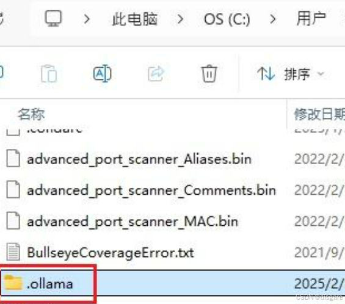
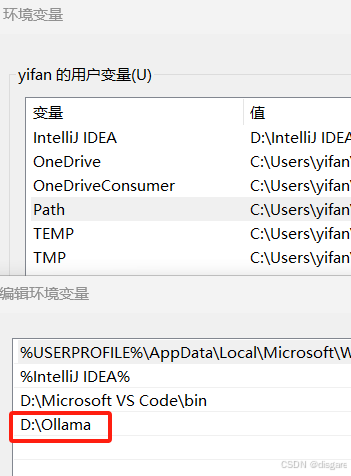
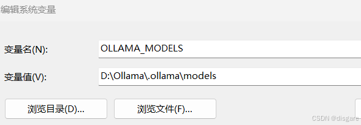

Ollama 安装的时候没有安装路径可选，只能是默认安装到 C 盘，安装后自身会占用很大的空间，另外在下载语言模型时占用的空间会逐渐增加。为了处理这个问题我决定将 ollama 迁移到 D 盘

迁移时可以按照如下流程：

1，创建 D:\Ollama 文件夹，用于存放 ollama 应用

2，在 C:\Users\用户名\.ollama 这个路径下含有 models 和 blobs 两个文件夹。如果下载语言模型是默认下载这个路径下的 blobs 文件夹里。因此 .ollama 这个文件夹需要移动到 D 盘指定的文件夹

3，C:\Users\用户名\AppData\Local\Programs 这个路径下 Ollama 整个文件夹复制到 D 盘指定文件夹里。这个文件夹就是 ollama 的本体

4，先配置用户变量：此电脑-》属性-》高级系统设置-》环境变量。在用户变量中设置 D:\Ollama。老实说我不知道这一步有没有用，因为比较核心的模型查找和 ollama 命令查找都在系统变量中

5，配置系统变量，添加系统变量：OLLAMA_MODELS，用于让系统找到模型存放位置

系统变量 Path 中添加系统变量 D:\Ollama\Ollama，用于让系统找到 ollama 命令的存放路径

6，重启

7，输入 ollama list，应该可以正常打印出已经下载的模型了。结束操作后，可以删除 C:\Users\用户名\.ollama 文件夹以及 C:\Users\用户名\AppData\Local\Programs\Ollama 文件夹