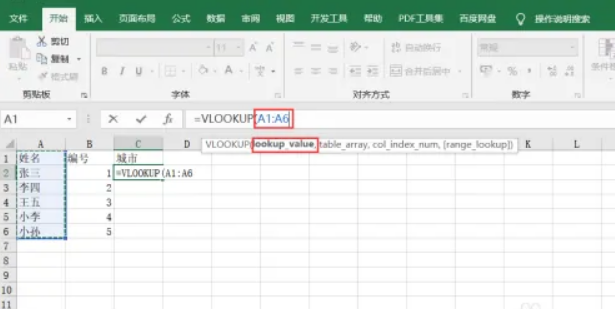

## 实现两张表格数据关联 =vlookup

实现两个 sheet 间的关联需要用 vlookup 函数实现，Vlookup被誉为【查询三剑客】之一，在 excel 里查询有着举足轻重的作用，下面来讲解一下函数
```
=VLOOKUP(lookup_value,table_array,col_index_num,[range-lookup])
```
函数第一个参数设置成 sheet1 中的 A 列（如果数据很多，可以直接选中 A 列），下图中输入了 A1:A6，其实直接点击 C1 单元格输入 A1 也可以


函数的第二个参数选中 sheet2 中的 A 列和 B 列，表示查询范围，**这里也可以输入 Sheet2!A:B**（而且一般都会这么写），表示 A 列和 B 列所有数据。注意这里有一个大坑，就是 VLOOKUP 函数要求查找列必须是范围中的第一列，而 Sheet1!C:D 范围中的第一列是 C 列，如果你想匹配 D 列的数据，就会匹配不到

同时，如果 B2 单元格的值和 Sheet1 的 C 列中的值格式不一致（例如，一个是文本，另一个是数字），也不会查找到数据


函数的第三个参数填需查找条件所在列数，实例中查找名字，但返回的城市在第二列，所以就填2


函数的第四个参数填1或者0，意思为模糊查找和精确查找，这里选择0，点击回车即可实现两个表格关联、

## 快速找出两列数据中的不同项
使用两个公式即可实现，EXACT 表示判断输入的两个数相同还是不相同，IF 表示如果输入的参数一为 true，则展示的二个参数，否则展示第三个参数
```
EXACT(C2,D2)
=IF(EXACT(C2,D2)=TRUE,"同","不同")
```

举个例子，下图中点击 E2，输入公式 =IF(EXACT(C2,D2)=TRUE,"同","不同")
