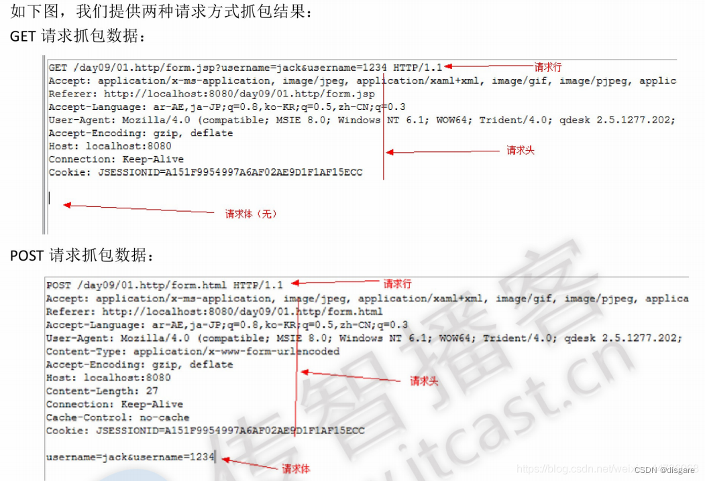

## DNS
DNS 的作用就是根据域名找到对应的 IP 地址

注意：通过 DNS 解析后，不知道对应端口还是无法访问接口，HTTP 默认使用 80 端口，HTTPS 默认使用 443 端口，因此当用户输入 http://example.com 或 https://example.com 时，浏览器会自动附加默认端口（80 或 443），无需用户显式指定。因此 DNS 解析是不加端口的

如果服务监听了非标准端口（如 8080），则需显式声明（如 http://example.com:8080）

如果用户访问的是默认端口（http://example.com，隐式 80 端口），但 Tomcat 运行在 8080，那么请求是如何到达 Tomcat 的呢？
这通常依赖反向代理（如 Nginx/Apache）或端口转发
### 域名的层级
网址的网址倒过来就是域名的层级关系

- 然后是根域名，这个 . 就是是根域名，默认情况下所有的网址的最后一位都是.，为了方便用户，通常都会省略，浏览器在请求 DNS 的时候会自动加上
- 根域名的下一级，叫做顶级域名，或者一级域名
- 再下一级叫做次级域名，这个域名用户可以自己注册，比如 baodu.com、alibaba.com 等
- 再再下一级叫做三级域名，这是用户在自己的域里面为服务器分配的名称，是用户可以任意分配的
### 查找过程
DNS 将域名解析为 IP 地址经历了迭代查找过程，按如下顺序：浏览器缓存、操作系统缓存、本地 DNS 服务器，根 DNS 服务器，顶级 DNS 服务器，主域名 DNS 服务器

1，浏览器缓存：首先，浏览器会检查自己的缓存中是否已经保存了该域名对应的 IP 地址。如果有，则直接使用缓存中的 IP 地址，跳过后续步骤（查询完毕后浏览器一般会保存 DNS 缓存，因此切环境的时候需要清理缓存：edge://net-internals/#dns）
2，操作系统缓存：如果浏览器缓存中没有找到对应的 IP 地址，浏览器会向操作系统发起 DNS 查询请求。操作系统会检查自己的 DNS 缓存，如果有对应的记录，则返回给浏览器（快速切缓存工具：SwitchHosts）
3，本地 DNS 服务器：如果操作系统缓存中没有找到对应的 IP 地址，操作系统会向本地 DNS 服务器发起查询请求。本地 DNS 服务器通常由网络服务提供商（ISP）提供，它负责缓存和转发 DNS 查询请求
4，递归查询：如果本地 DNS 服务器没有缓存对应的 IP 地址，它会向根域名服务器发送查询请求。根域名服务器负责管理顶级域名（如.com、.org、.net 等）的 DNS 服务器地址
5，迭代查询：根域名服务器会返回给本地 DNS 服务器一个顶级域名服务器的地址。本地 DNS 服务器再向顶级域名服务器发送查询请求，获取下一级域名服务器的地址
6，迭代查询继续：本地 DNS 服务器会继续向下一级域名服务器发送查询请求，直到找到负责该域名的权威域名服务器
7，权威域名服务器：权威域名服务器是负责管理特定域名的服务器，它会返回给本地 DNS 服务器该域名对应的 IP 地址
8，返回结果：最后，本地 DNS 服务器将获取到的 IP 地址返回给操作系统，然后操作系统将 IP 地址返回给浏览器
### 优化
1，DNS 缓存：当 DNS 服务器找到网址后，网址的 IP 地址与域名的映射关系会存入每一个 DNS 服务器的 DNS 缓存中，便于下一次查找。DNS 是以存活时间来衡量缓存的有些情况的，一旦 DNS 服务器中映射发生变化，DNS 没有任何手段来保证缓存的一致性，只能通过缓存超时来处理

2，负载均衡：同一个域名可能有多个服务器，DNS 会根据负载均衡策略返回承载量最少（或者最近的）服务器 IP 给客户端。这个策略可以由域名服务器自己决定，甚至可以根据访问者所处的不同地区、不同服务商等因素来确定返回最合适的记录

3，DNS 预取：一种前端优化手段，如果网站后续需要使用来自其他域的资源，就在网站加载的时候生成一个 link 请求促使浏览器对该域名进行预解释。简单来说就是在点进网站的时候网站就自动将资源中域名解析为 ip 地址
### 常见的 DNS 攻击
1，域名劫持：通过采用黑客手段控制了域名管理密码和域名管理邮箱，然后将该域名的 NS 纪录指向到黑客可以控制的 DNS 服务器，然后通过在该 DNS 服务器上添加相应域名纪录，从而使网民访问该域名时，进入了黑客所指向的内容

2，缓存投毒：利用控制 DNS 缓存服务器，把原本准备访问某网站的用户在不知不觉中带到黑客指向的其他网站上

3，DDOS 攻击：一种攻击针对 DNS 服务器软件本身，通常利用 BIND 软件程序中的漏洞，导致 DNS 服务器崩溃或拒绝服务;另一种攻击的目标不是DNS服务器，而是利用 DNS 服务器作为中间的“攻击放大器”，去攻击其它互联网上的主机，导致被攻击主机拒绝服务

4，DNS 欺骗：DNS 欺骗就是攻击者冒充域名服务器的一种欺骗行为。如果可以冒充域名服务器，然后把查询的 IP 地址设为攻击者的 IP 地址，这样的话，用户上网就只能看到攻击者的主页，而不是用户想要取得的网站的主页了
### 使用的协议
虽然 DNS 服务器支持 TCP 和 UDP 双协议，但是通常我们在做 DNS 查询的时候，也只用到了 UDP 协议

使用基于 UDP 的 DNS 协议只要一个请求、一个应答就好了，而使用基于 TCP 的 DNS 协议要三次握手、发送数据以及应答、四次挥手，明显基于 TCP 协议的 DNS 更浪费网络资源

DNS 通常在以下两种情况下使用 TCP 协议：

1，DNS 查询响应报文大于 512 字节时
2，DNS 为保证高可用，需要搭载 DNS 集群（只用作主备模式），进行主从复制的时候，使用 TCP 连接保证成功率
### CDN
一般使用 DNS 来实现内容分发网络的功能，即 CDN。CDN 是一项古老的技术，它的主要作用是将一些静态资源放置的离用户跟进一些以提升访问速度，因为这些静态资源一般非常大并且不太容易被修改，建立 CDN 会网络流量起到分流减负的作用

CDN 的核心理念，就是将内容缓存在终端用户附近。同时，CDN 与镜像服务器也不太一样，镜像服务器是源内容服务器的完整复制。而 CDN，是部分内容的缓存，智能程度更高

确切地说，**CDN = 更智能的镜像 + 缓存 + 流量导流**。同时注意 CDN 是无法缓存业务请求的，比如你想往数据库里插入什么或者调用接口实现什么服务，CDN 可不会帮你完成这些事情
#### 路由解析
那么 CDN 是如何实现的呢？一个有 CDN 的 DNS 应答和没有 CDN 的 DNS 应答是不一样的，在域名解析时，域名的权威 DNS 会将访问的域名返回 **CNAME**（一般会返回下一级的 DNS 或者网站 IP 地址），这个 CNAME 就是实现路由解析的重点

能够解析 CNAME 的只有 CDN 服务商架设的权威 DNS，因此本地 DNS 通过到 CNAME 的权威 DNS 中查询该 CNAME， 获得最合适的镜像 IP 来替换原站的 IP，DNS 一般通过一定的负载均衡策略与参数，比如拓扑结构、容量、时延等来挑选合适的 IP
#### 内容分发
即使网络镜像不会轻易改变静态资源的内容，但是存放资源的节点还是可能做改变的，比如存放新资源啥的，如果资源变更那么 CDN 的缓存节点会做什么处理呢，而且如果 CDN 的缓存节点中没有用户想要的资源副本的话，又应该做什么操作呢

一般来说，节点获取资源的方式有以下几种，一是主动分发，二是被动回源，对应资源的惰性更新与定时更新

**主动分发说的是资源分发由源站发起，将内容从源站或者其他资源库推送到用户边缘的各个 CDN 缓存节点中**，这个推送的操作没有什么标准，一般分发用于网站要预载大量的资源的场景，譬如在双十一之前的一段时间电商网站会把未来活动中要用到的资源推送到 CDN 中去

**被动回源发生在用户的访问中，某个资源首次被用户请求时，CDN 缓存发现自己没有该资源，就会实时从源站中获取**

对于节点如何更新资源可以参考 redis 中的缓存过期策略，也是定时与惰性，给与缓存资源一定的生存期超过了生存期下次访问就被动回源一次，而手动失效指 CDN 服务商一般会提供处理失效缓存的接口
## HTTP 协议
超文本传输协议（Hypertext Transfer Protocol，HTTP）是一个简单的请求-响应协议，它通常运行在TCP之上。它指定了客户端可能发送给服务器什么样的消息以及得到什么样的响应，以此为标准可以分为请求报文与响应报文

### HTTP 请求报文

1，请求行：包括对服务端的请求方式（get、post）、请求路径以及参数、协议版本号（如 HTTP/1.1 或 HTTP/2）

2，请求头：附加信息，是一个个的键值对，如 Connection：Keep-alive

常见的请求头内容：

- Connection: 控制连接行为（如 keep-alive）
- Date: 请求发送的日期时间
- Host: 请求的目标主机和端口
- Cookie: 客户端存储的 cookie 数据
- Origin: 请求的来源（用于 CORS）
- content-type：请求体是什么格式的

3，请求体：传递给客户端数据储存在请求正文中，如上传文件、post 提交表单等操作

HTTP 请求可以使用多种请求方法，比如 post、put、get、delete 等
#### GET 和 POST 有什么区别
开发过 web 的人都可能说出一二，比如：

- GET 参数通过 URL 传递，POST 放在 Request body 中；
- GET 请求在 URL 中传送的参数是有长度限制的，而 POST 没有；
- 发送 post 报文时会先发送请求头，等待一段时间后再发送请求体

但是这都是表象，HTTP 的底层是 TCP/IP。所以 GET 和 POST 的底层也是 TCP/IP，也就是说，GET/POST 都是 TCP 链接。因此 GET 和 POST 能做的事情是一样一样的。如果你要**给 GET 加上 request body，给 POST 带上 url 参数，技术上是完全行的通的**，就是不太合理，而且前端也会抓狂

因此，它们本质上没什么区别，都是基于 TCP 连接，都是 HTTP 请求报文，而超文本传输协议是一种约定，它规定传输的时候应该怎么这么做。如果要把 GET 加上 request body，可以，但是有一些服务器可能会保证读取内容，但是另外一些会直接丢弃。因此 GET 和 POST 只是约定的不同，即 get 通常用于请求数据，不改变服务器状态，post 用于提交数据，会改变服务器状态

还有一件在网上比较出名的事情，就是有时候 POST 可能会发送两个数据包，一个是 header，另一个是 body，比如在ruby的net::HTTP库，会将一个http请求拆分，先发送header部分。也就是说，相同类型的请求也有实现的不同

它们的不同决定了它们应用场景的不同

对服务器请求是查询时使用get，url可能会很长并且明文（把信息在url后面），在URL中传送的参数有长度限制，可以成为书签，没有请求体

对数据库进行修改时使用post，原因是安全（信息在请求体中）
#### 幂等性和非幂等性
幂等性是指在服务器资源没有被其他方式改变的情况下一个请求不管请求多少次返回的资源都不会出现变化，非幂等性则是每次请求都会返回不同的结果

幂等性是分布式系统设计中十分重要的概念，具有这一性质的接口在设计时总是秉持这样的一种理念：调用接口发生异常并且重复尝试时，总是会造成系统所无法承受的损失，所以必须阻止这种现象的发生

HTTP GET 方法用于获取资源，不应有副作用，所以是幂等的

HTTP DELETE 方法用于删除资源，有副作用，但它应该满足幂等性，因为它只会删除一次资源

HTTP POST 方法不具备幂等性，因为每次调用都会在服务器创建新的东西

HTTP PUT 请求方法请求服务器接受并存储提供的 URI 中包含的实体。 如果该 URI 引用已经存在的资源，则该资源被修改; 如果 URI 不指向现有资源，则服务器可以使用该 URI 创建资源，因此它是非幂等性的
#### 前后端传参
Http 数据传参只有两种方式：uri 传参和 body 传参

数据参数写在 uri 地址中，可以为查询参数，也可以为路径参数，一般GET请求方式用的多。一个TCP传输就可以将参数传递给服务器，速度快。但是参数直接暴露在浏览器中，不安全

**在 uri 里传递的参数在 postman 中使用 Params 传递，在后端中用 @RequestParam 接受**

数据参数写在body体中，有多种content-type格式：json、xml、form-data，一般post请求方式用的多。相对安全，没有大小限制，这里分析三个：

（1）application/x-www-form-urlencoded(默认类型)
如果不指定其他类型的话, 默认是x-www-form-urlencoded, 此类型要求参数传递样式为 key1=value1&key2=value2，只是不加在 url 中，加在 body 中。无注解 或者 @RequestParam 获取并解析body中的multipart/form-data和x-www-form-urlencoded

（2） application/json
更适合传递大数据的形式, 参数样式就是json格式, 例如{"key1":"value1","key2":[1,2,3]}等，使用 @RequestBody 获取并解析body中的application/json格式数据

（3）multipart/form-data
也是浏览器的原生 form 表单格式，与上面不同的是，这个既可以传键值对，也可以用来上传文件。我们使用表单上传文件时，必须让 form 的 enctyped 等于这个值
### HTTP 响应报文
1，响应行：状态码，协议版本号

2，响应头：附带信息，对应请求报头

常见的响应信息如下：

- Content-Encoding：文档的编码（Encode）方法。只有在解码之后才可以得到 Content-Type 头指定的内容类型
- Date：当前的GMT时间。你可以用setDateHeader来设置这个头以避免转换时间格式的麻烦。
- **Content-Type**：内容类型，表示后面的文档属于什么 MIME 类型。Servlet 默认为 text/plain，但通常需要显式地指定为 text/html。由于经常要设置Content-Type，因此HttpServletResponse提供了一个专用的方法setContentType

3，响应体：返回的主体信息，http，css 等数据都是放在响应体中的
### 状态码
1xx：请求正在被处理
2xx：成功响应
3xx：重定向
4xx：客户端错误（客户端找到的地址错误，或者服务器转发地址错误）
5xx：服务器错误，未响应合理请求（代码写错了）

常见状态码：
100：要求继续发送数据，**比如在收到第一个预检请求的时候服务器会返回这个**
101：服务器已接受客户端的请求，并将切换到新的协议，比如长连接的切换

200：成功，一般用于 GET 与 POST 请求
201：已创建。成功请求并创建了新的资源
202：已接受。已经接受请求，但未处理完成
204：返回空内容

301：永久重定向（服务器返回一个新域名，此时用户使用新域名去访问服务器得到网站，并且浏览器网站变更为新网址，当多个域名指向网站主域通常使用301）
302：暂时重定向（用户的浏览器在收到响应后，输入栏仍是显示旧网址，但是显示的是新网址的内容，在 csdn 里访问外网时会弹出一个拦截，使用的就是暂时重定向）

401 SC_UNAUTHORIZED：用户请求成功但当前提供的认证信息不正确或者不足以确认用户的身份。通常，当用户尝试访问受保护的资源而没有提供正确的凭证（如用户名和密码）时，服务器会返回401状态码
403 SC_FORBIDDEN：用户请求成功，但是服务器认为客户端没有足够的权限访问所请求的资源
404：**服务器接到请求，但是找不到对应的接口地址**

500：服务器内部错误（一般是代码错误），并且没有进行捕获
### 301和302
HTTP 状态码中，301和302都是网页重定向跳转，但是两者的使用场景和效果是不一样的，不认真学习很容易搞混

301 是永久重定向，表示所请求的资源已经永久地转移到新的位置，这包含域名的改变或者是资源路径的改变，比如下面这个请求，返回的响应头中会带有重定向的 url。对于301重定向的使用没有规定，即使很短时间的更换资源位置信息，也可以使用301重定向

**搜索引擎在遇到301状态码时会更新索引，并将之前的URL替换为新的URL**（搜索引擎指的是像百度、谷歌等互联网搜索引擎。当搜索引擎爬取网页时，会检查网页的HTTP响应状态码。如果遇到301状态码，搜索引擎会将之前的URL替换为新的URL）。**客户端在接收到301状态码后，下次请求时会直接访问新的 URL**（这里的实现是客户端的缓存，浏览器会更改自身的 URL缓存，将旧的路径换为新的路径）

302状态码是临时重定向，表示所请求的资源临时地转移到新的位置，一般是24到48小时以内的转移会用到302。**搜索引擎在遇到302状态码时不会更新索引，并且客户端在接收到302状态码后，下次请求时会继续访问原来的 URL**

像这样的 mvc 代码，就会返回一个 302 的请求
```java
return new ModelAndView(new RedirectView("/freeCombine/error"));
```

为什么会出现重定向这个操作？

举个例子：网站是会被大量用户收藏在自己的浏览器收藏夹的，当然收藏的是URL，即资源位置，当网站原资源路径发生改变时，如果不进行重定向操作，当用户再次访问收藏的资源时，由于原位置已经改变不存在，那么服务器只会给用户返回404，这是不应该发生的

因此出现了重定向操作，即当用户访问改变了位置的资源时，通过服务器的反馈得知资源位置已经改变，随即浏览器就会访问改变后的资源位置，而不会引发404。返回重定向的响应后，浏览器会自动请求新的地址。当用户访问一个 url 的时候我们希望他转到另外一个 url，我们就可以使用重定向的代码

除此之外还有 307、308。307 临时重定向（保留请求方法）含义：307 状态码和 302 类似，也是临时重定向，但它会保留原请求的方法和请求体。当客户端收到 307 响应时，会使用与原请求相同的方法和请求体去请求新的 URL。308 同理
### content-type 与 MIME
content-type 说明了该响应体包含了什么信息，浏览器应该以什么形式、什么编码读取这个文件，这就是经常看到一些 PHP 网页点击的结果却是下载一个文件或一张图片的原因

```yml
Content-Type: text/html; charset=utf-8
Content-Type: multipart/form-data; boundary=something
```
这是一个标准的 content-type 属性，text/html 则是 MIME，MIME (Multipurpose Internet Mail Extensions) 是描述消息内容类型的标准，用来表示文档、文件或字节流的性质和格式

MIME 消息能包含文本、图像、音频、视频以及其他应用程序专用的数据，MIME 的组成结构非常简单，由类型与子类型两个字符串中间用 / 分隔而组成，不允许有空格。type 表示可以被分多个子类的独立类别，subtype 表示细分后的每个类型，比如：

- 超文本标记语言文本 .html、.html：text/html
- 普通文本 .txt： text/plain
- RTF 文本 .rtf： application/rtf
- GIF 图形 .gif： image/gif
- JSON数据格式：application/json
### 长连接和短连接
http 的长连接与短链接实质上是 TCP 的连接，http1.1 的长连接使用了线程池实现了连接复用。因为 TCP 需要三次握手，并且还有慢启动的特性，导致 HTTP 在一开始传输数据的时候速度很慢，为了适应 TCP 这种传输大量数据时连接不至于成为瓶颈的特性，出现了 HTTP 长连接的技术

- 长连接：在 HTTP/1.1 中默认使用，资源获取后 TCP 连接不断开，减少建立连接线路时的资源消耗
- 短链接：在 HTTP/1.0 中默认使用，每传输一次 web 资源，tcp 都会断开

使用长连接是为了减少 TCP 的连接数量，但是这么做并非只有好处，因为长连接从同一个服务器中获取数据时，假如某一个资源获取数据的时间过长，后续的资源都需要进行等待，这种情况做成并发比较合适

同时还需要注意一些已经被解决的问题，比如在长连接中如何以不断开 TCP 连接为标识来判断资源已经传输完毕呢？这就可以借鉴之前 TCP 的传输原理了，可以在返回的响应头中加入该资源的大小 Content-Length，如果到了说明该资源传输完毕

单独有这一机制肯定是不够的，比如现在有一种情况，就是 HTTP 在传输压缩时，除了预先将压缩后的资源返回以外，还支持一种即时压缩的功能，整个压缩过程全部在内存的数据流中完成，这样就造成一个问题，HTTP 无法在数据传输之前获取该压缩资源的大小

此时我们有了一个新设计，在响应头中可以加入 Transfer-Encoding:cjunked 之后，报文中的 body 会改用一系列分块来传输，每个分块有长度值与对应长度的数据内容，最后一个长度为 0 的分块代表资源结束
### 长轮询和短轮询
短轮询，是客户端定期向服务器发送请求，比如每隔几秒请求一次，看看有没有新数据。每次服务器都会立即响应，不管有没有数据。这可能会有很多无效的请求，尤其是当数据更新不频繁的时候，这样会浪费带宽和服务器资源

长轮询是客户端发送一个请求到服务器，**服务器不会立即响应，而是保持连接打开，直到有数据可发或者超时**。当有数据或超时后，客户端再发送新的请求。这样可以减少不必要的请求次数，但服务器需要保持连接，可能会增加负担
### 线程池的连接复用
在 HTTP1.1中，HttpClient 通过连接池来管理持久连接，在一个 TCP 连接上可以传送多个 HTTP 请求和响应，减少了建立和关闭连接的消耗和延迟（在物理层这个叫时分复用）

连接池对 keepalive 的主要需要处理两个地方：一个是 maxKeepAliveRequests 连接达到最大的设置次数，超过这个次数其他的连接都会被设定为短链接，另一个为 keepAliveTimeout 超过该时间没有流量，则会关闭掉连接

这种方法的缺点是，连接复用基于 TCP，多个 HTTP 连接到一个 TCP 端口，若干个请求排队串行化单线程处理，后面的请求等待前面请求的返回才能获得执行机会，因此有某个请求处理时间过长，后面的请求只能等待
### HTTP 如何保存用户状态（session、cookie、token 混合使用）
http 无状态，即连接后不知道客户端状态，翻译成通俗的语言就是系统不知道哪个用户进行操作

session：存放在服务器，用于获取用户状态，session 一般存放在缓存或者数据库中，一般在 cookie 中存放 sessionID，这个 sessionID 可以唯一标识一个用户以此让系统知道该连接对应哪个用户，如果 cookie 被禁用，则存放在 URL 中

cookie：存放在用户端，用于记录用户信息或者服务器返回的数据，这些数据可以让系统了解该用户状态

token：有些系统会返回一个token存放在cookie中，token是服务端生成的一串字符串，以作客户端进行请求的一个令牌，用户只要带上这个令牌就无需再次带上用户名和密码

那么问题来了，token 不和 sessionID 作用一样吗，它们有什么区别啊？

token 是无状态的，在使用 sessionID 的情况下如果大量的用户访问会占用大量的空间，而且在分布式系统中，存放 sessionID 需要考虑数据一致性问题，而如果是 token 的话，系统接受后会进行一系列认证过程来确定用户，以 CPU 计算时间换取存储空间
### HTTP2.0 和3.0的多路复用
HTTP2.0 的 IO 多路复用有两个很重要的概念分别叫流和帧

流代表某个客户端和服务器的连接，每个流都有一个独一无二的 ID，多个流可以在一个 http 连接中

帧就是流动在流中的最小单元，以二进制格式来传输数据，用唯一的 ID 来标记它属于哪一个流，在 HTTP/2 的标准中定义了10种不同的帧类型，包括帧头、数据帧、终止流等等

多路复用代替了 HTTP1.x 的序列和阻塞机制，所有的相同域名请求都通过同一个 TCP 连接并发完成。同一 TCP 中可以发送多个请求，对端可以通过帧中的标识知道属于哪个请求。通过这个技术，可以避免 HTTP 旧版本中的队头阻塞问题，极大的提高传输性能

这种方式解决了队头阻塞，大文件的帧不会阻塞小文件的帧。但是 http 是基于 TCP 的。TCP 要求数据按顺序交付。如果包#3丢失，即使包#4、#5已到达，也必须等待#3重传。HTTP/2的多路复用在单条TCP连接上，一个丢失的帧会阻塞该连接上所有其他流

http3就不会，每个流独立，流#3丢包只影响流#3，其他流继续传输
## URI 和 URL
URI(Uniform Resource Identifier) 是统一资源标志符，可以唯一标识一个资源。比如www.baidu就是www.baidu.com的URI。uri是不固定的，是相对来说的，具体是什么就看你的参照角度是什么

URL(Uniform Resource Locator) 是统一资源定位符，可以提供该资源的路径。它是一种具体的 URI（URI时URL的父类），即 URL 可以用来标识一个资源，而且还指明了如何 locate 这个资源，大家把浏览器地址栏里访问网站的地址认为是URL就好了
## HTTPS
### 基础概念
**密钥**：密钥是一种参数，它是在明文转换为密文或将密文转换为明文的算法中输入的参数，可以将它理解成现实生活中的钥匙

**对称加密**：加密解密使用相同密钥，双方在建立连接时商定一个密钥，之后双方使用这个密钥进行加密解密，双方之间传输的是加密后的报文

对称使用一把密钥加密，使用同一把密钥解密。对称加密由于加解和解密使用的是同一个密钥算法，故而在加解密的过程中速度比较快，适合于数据量比较大的加解密

这个方法的缺点在于，双方在建立连接时商定密钥的报文被截取了，任何人都可以冒充目标，所以这个方法不是很安全

**非对称加密**：这种加密可以生成公钥和私钥，公钥可以用来加密数据，但是不能解密数据。私钥可以用来解密，但是不能用来加密。公钥是公开的，私钥是私有的，私钥一般不会进行网络传输

非对称加密在建立连接时向对方发送公钥，这样就是被截取了，也不能解密数据。这个方法的缺点在于性能，双方都得向对方发送公钥

### TLS 加密过程

TLS 协议是基于 TCP 协议之上的，中文名字叫安全传输层协议

图中第一个蓝色往返是 TCP 的握手过程，之后两次橙色的往返，我们可以叫做 TLS 的握手，所以 TLS 一共握手三个来回。握手过程如下：

Client1：TLS 版本号+所支持加密套件列表+希望使用的 TLS 选项

Server1：选择一个客户端的加密套件+自己的公钥+自己的证书+希望使用的 TLS 选项+要求客户端证书

Client2：自己的证书+使用服务器公钥和协商的加密套件加密一个对称秘钥（自己生成的一个随机值）

Server2：使用私钥解密出对称秘钥（随机值）后，发送加密的 Finish 消息，表明完成握手。其核心思想在于使用非对称加密加密对称密钥
### HTTPS 加密过程
HTTPS 使用对称加密和非对称加密混合使用的方式加密数据，**非对称加密的公钥主要用来加密对称加密协商时生成的密钥**，具体加密过程如下：

首先，客户端发起握手请求，以明文传输请求信息，包含版本信息，加密-套件候选列表，压缩算法候选列表，随机数，扩展字段等信息（这个没什么好说的，就是用户在浏览器里输入一个 HTTPS 网址，然后连接到服务端的443端口）

服务端的配置，采用 HTTPS 协议的服务器必须要有一套数字证书，可以自己制作，也可以向组织申请

服务端返回协商的信息结果，包括选择使用的协议版本 version，选择的加密套件 cipher suite，选择的压缩算法 compression method、随机数 random_S 以及证书（这个证书其实就是公钥，只是包含了很多信息，如证书的颁发机构，过期时间等等）

客户端验证证书的合法性，包括可信性，是否吊销，过期时间和域名。这部分工作是由客户端的 TLS 来完成的，首先会验证公钥是否有效，比如颁发机构，过期时间等等，如果发现异常，则会弹出一个警示框，提示证书存在的问题。如果证书没有问题，那么就生成一个随机值。然后用证书（也就是公钥）对这个随机值进行加密

客户端使用公匙对对称密匙加密，发送给服务端（这部分传送的是用证书加密后的随机值，目的是让服务端得到这个随机值，以后客户端和服务端的通信就可以通过这个随机值来进行加密解密了）

服务器用私钥解密，拿到对称加密的密匙。传输加密后的信息，这部分信息就是服务端用私钥加密后的信息，可以在客户端用随机值解密还原

所以流程为用非对称加密对称密钥，TLS 提供底层支持（验证证书、加密等底层流程都是 TLS 做的）
### SSL
SSL 协议可分为两层： SSL 记录协议（SSL Record Protocol）：它建立在可靠的传输协议（如 TCP）之上，为高层协议提供数据封装、压缩、加密等基本功能的支持

HTTPS 是 HTTP 报文直接将报文信息传输给 SSL 套接字进行加密，SSL 加密后将加密后的报文发送给 TCP 套接字，然后 TCP 套接字再将加密后的报文发送给目的主机，目的主机将通过 TCP 套接字获取加密后的报文给 SSL 套接字，SSL 解密后交给对应进程

SSL 握手协议（SSL Handshake Protocol）：它建立在 SSL 记录协议之上，用于在实际的数据传输开始前，通讯双方进行身份认证、协商加密算法、交换加密密钥等

SSL 目前已经过时了，现在大多都用 TLS
### HTTP 和 HTTPS 的区别
http 为明文传输，不加密，使用端口80， HTTP 协议运行在 TCP 之上

https 在建立连接时使用对称加密与非对称加密混合使用，https 使用端口为 443，HTTPS 是运行在 SSL/TLS 之上的应用层协议